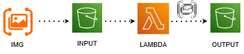

# Projeto de integração serverless com S3

## Objetivo do laboratório

Realizar a integração de uma função através do serviço de computação serverless orientada a eventos (Lambda) com o serviço de armazenamento S3. Sempre que uma imagem for adicionada no bucket de entrada, a função será acionada automaticamente adicionando um texto no arquivo e salvando-o no bucket de saída.

## Visualização da arquitetura

## Visualização do código

* acesse : code.py

## Resultado da adição do texto na imagem

