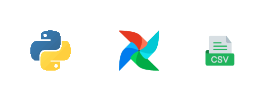

# Projeto: Pipeline de Dados Meteorológicos com Apache Airflow

## 📌 Sobre o projeto

Este projeto está sendo desenvolvido como parte dos estudos em **Engenharia de Dados**, com o objetivo de compreender, na prática, como funciona a construção e a execução de um pipeline de dados utilizando o **Apache Airflow**.

A proposta inicial é construir um pipeline simples capaz de **capturar dados meteorológicos por meio de uma API**, transformar essas informações em uma estrutura tabular e armazená-las em um arquivo CSV. A execução desse processo é orquestrada por uma **DAG (Directed Acyclic Graph)** no Airflow.

O projeto também tem como objetivo explorar a arquitetura de execução do Airflow em um ambiente local, utilizando **WSL/Ubuntu e Docker** para executar a infraestrutura necessária.

> 🚧 **Status:** Projeto em desenvolvimento.

---

## 🎯 Objetivos

Os principais objetivos deste projeto são:

* Compreender o funcionamento básico de um pipeline de dados;
* Aprender a consumir dados de uma API utilizando Python;
* Trabalhar com informações de localização geográfica, como latitude e longitude;
* Capturar informações de temperatura;
* Utilizar o Pandas para estruturar os dados;
* Armazenar os dados coletados em arquivos CSV;
* Criar e configurar uma DAG no Apache Airflow;
* Compreender o ciclo de execução de uma DAG e suas tasks;
* Entender como o Airflow realiza o gerenciamento e a execução de tarefas;
* Aprender como aplicações e dados podem ser organizados em containers Docker;
* Explorar a integração entre **WSL/Ubuntu, Docker e Apache Airflow**.

---

# 🏗️ Arquitetura do projeto

A arquitetura inicial do projeto pode ser representada da seguinte forma:



```text
                    ┌─────────────────────┐
                    │   API Meteorológica │
                    │     OpenWeather     │
                    └──────────┬──────────┘
                               │
                               │ HTTP Request
                               ▼
                    ┌─────────────────────┐
                    │       Python        │
                    │    requests/pandas  │
                    └──────────┬──────────┘
                               │
                               │ Tratamento
                               ▼
                    ┌─────────────────────┐
                    │     DataFrame       │
                    │      Pandas         │
                    └──────────┬──────────┘
                               │
                               │ Exportação
                               ▼
                    ┌─────────────────────┐
                    │       CSV           │
                    │   /opt/airflow/data │
                    └─────────────────────┘
                               ▲
                               │
                    ┌──────────┴──────────┐
                    │    Apache Airflow   │
                    │         DAG         │
                    └─────────────────────┘
```

O Airflow atua como o **orquestrador do pipeline**, sendo responsável por controlar quando e como as tarefas devem ser executadas.

---

# 1. 🌎 Captura dos dados via API

A primeira etapa do pipeline consiste em realizar uma requisição para uma **API de dados meteorológicos**.

O projeto utiliza informações de localização geográfica, principalmente:

* Latitude;
* Longitude;
* Temperatura;
* Sensação térmica;
* Data e horário da previsão.

A localização é definida por meio de coordenadas geográficas. Para o projeto, as coordenadas correspondentes à cidade de Recife são utilizadas para consultar os dados meteorológicos.

A requisição é realizada utilizando a biblioteca `requests` do Python.

Exemplo conceitual:

```python
import requests

params = {
    "lat": -8.0476,
    "lon": -34.8770,
    "units": "metric",
    "lang": "pt_br",
    "appid": API_KEY
}

response = requests.get(
    url,
    params=params,
    timeout=10
)

response.raise_for_status()

dados = response.json()
```

O retorno da API é disponibilizado no formato **JSON**, contendo diversas informações meteorológicas.

A partir desse retorno, são selecionadas as informações necessárias para o projeto.

---

# 2. 📊 Transformação e inserção dos dados em CSV

Após a captura dos dados, o retorno da API é tratado utilizando **Pandas**.

O objetivo dessa etapa é transformar os dados originalmente estruturados em JSON em uma estrutura tabular representada por um `DataFrame`.

Exemplo:

```python
import pandas as pd

df = pd.DataFrame(dados["list"])
```

A partir do DataFrame, podem ser selecionadas e organizadas as informações relevantes para o projeto, como:

```text
data_hora
latitude
longitude
temperatura
sensacao_termica
umidade
pressao
```

Depois do tratamento, os dados são armazenados em um arquivo CSV:

```python
df.to_csv(
    "/opt/airflow/data/dados_tempo.csv",
    index=False
)
```

O diretório `/opt/airflow/data` é disponibilizado ao container do Airflow por meio de um **volume Docker**, permitindo que os arquivos gerados pelo pipeline sejam persistidos no ambiente local.

---

# 3. ⚙️ Execução do Python por meio de uma DAG

A terceira etapa consiste em utilizar o **Apache Airflow** para realizar a orquestração do processo.

No Airflow, o pipeline é representado por uma **DAG (Directed Acyclic Graph)**.

A DAG define as tarefas que precisam ser executadas e suas respectivas configurações.

Inicialmente, o projeto possui uma task responsável por executar a função Python que realiza a captura e o processamento dos dados.

De forma simplificada:

```text
DAG
 │
 └── captura_dados_api
          │
          ├── Consulta API
          │
          ├── Processa JSON
          │
          ├── Cria DataFrame
          │
          └── Salva CSV
```

A execução da DAG permite acompanhar o pipeline por meio da interface web do Airflow, possibilitando visualizar:

* Estado da DAG;
* Estado das tasks;
* Logs de execução;
* Tempo de execução;
* Falhas;
* Tentativas de execução;
* Dependências entre tarefas.

---

# 🐳 Ambiente de execução

O projeto está sendo executado **localmente**, utilizando uma combinação de tecnologias para reproduzir um ambiente semelhante ao encontrado em projetos de Engenharia de Dados.

A arquitetura do ambiente é composta por:

```text
Windows
   │
   ▼
WSL
   │
   ▼
Ubuntu
   │
   ▼
Docker
   │
   ▼
Apache Airflow
```

O **WSL (Windows Subsystem for Linux)** é utilizado para disponibilizar um ambiente Linux dentro do sistema operacional Windows.

Dentro do Ubuntu, o **Docker** é utilizado para executar os containers necessários para o funcionamento do Apache Airflow.

A imagem do Airflow é utilizada como base para a execução da aplicação e seus componentes.

---

# 📁 Estrutura inicial do projeto

A estrutura do projeto está organizada aproximadamente da seguinte maneira:

```text
airflow/
│
├── dags/
│   └── captura_dados.py
│
├── data/
│   └── previsao_recife.csv
│
├── config/
├
├── logs/
│
├── plugins/
│   └── request_data.py
│   
└── docker-compose.yaml
```

### `dags/`

Contém os arquivos Python responsáveis pela definição das DAGs do Airflow.

### `data/`

Diretório destinado ao armazenamento dos dados produzidos pelo pipeline.

### `logs/`

Armazena os logs gerados durante a execução das DAGs e tasks.

### `plugins/`

Diretório reservado para possíveis extensões e componentes personalizados do Airflow.

### `config/`

Diretório reservado para configurações

### `docker-compose.yaml`

Arquivo responsável pela configuração dos serviços e volumes utilizados pelo ambiente Docker.

---

# 🔄 Fluxo de execução

O fluxo atual do projeto pode ser resumido em:

```text
1. Airflow inicia a DAG
            ↓
2. Task Python é executada
            ↓
3. Python realiza requisição para a API
            ↓
4. API retorna os dados em JSON
            ↓
5. Dados são tratados
            ↓
6. DataFrame é criado com Pandas
            ↓
7. DataFrame é exportado para CSV
            ↓
8. CSV é armazenado no diretório data
```

Esse fluxo representa uma primeira implementação de um **pipeline de ingestão e armazenamento de dados**.

---

# 📚 Conceitos estudados

Durante o desenvolvimento deste projeto, estão sendo explorados conceitos importantes de Engenharia de Dados, como:

* APIs REST;
* Requisições HTTP;
* JSON;
* Dados geográficos;
* Pandas;
* DataFrames;
* Arquivos CSV;
* ETL/ELT;
* Pipelines de dados;
* Orquestração de dados;
* Apache Airflow;
* DAGs;
* Tasks;
* XCom;
* Logs;
* Docker;
* Containers;
* Volumes;
* WSL;
* Linux/Ubuntu;
* Persistência de dados.

---

# 🚧 Próximos passos

Por se tratar de um projeto em desenvolvimento, algumas melhorias estão planejadas para as próximas etapas.

Entre elas:

* [ ] Melhorar o tratamento dos dados recebidos pela API;
* [ ] Separar as etapas de ingestão e transformação em diferentes tasks;
* [ ] Adicionar tratamento de exceções;
* [ ] Implementar retries para falhas na API;
* [ ] Utilizar variáveis/Connections do Airflow para armazenar credenciais;
* [ ] Evitar exposição da API Key no código;
* [ ] Melhorar a organização dos arquivos de dados;
* [ ] Criar um pipeline de transformação mais estruturado;
* [ ] Avaliar o armazenamento dos dados em formatos como Parquet;
* [ ] Integrar o pipeline posteriormente a um banco de dados;
* [ ] Explorar o agendamento automático da DAG;
* [ ] Monitorar as execuções por meio dos logs do Airflow.

---

# 💡 Aprendizado

Mais do que simplesmente coletar dados meteorológicos, o objetivo deste projeto é compreender **como um pipeline de dados pode ser estruturado, executado e monitorado utilizando uma ferramenta de orquestração**.

O projeto representa uma implementação inicial e experimental, construída durante o processo de aprendizado sobre **Engenharia de Dados e Apache Airflow**.

A utilização conjunta de **WSL/Ubuntu, Docker e Airflow** permite estudar, em um ambiente local, conceitos que posteriormente podem ser aplicados em arquiteturas de dados mais complexas e ambientes de produção.
